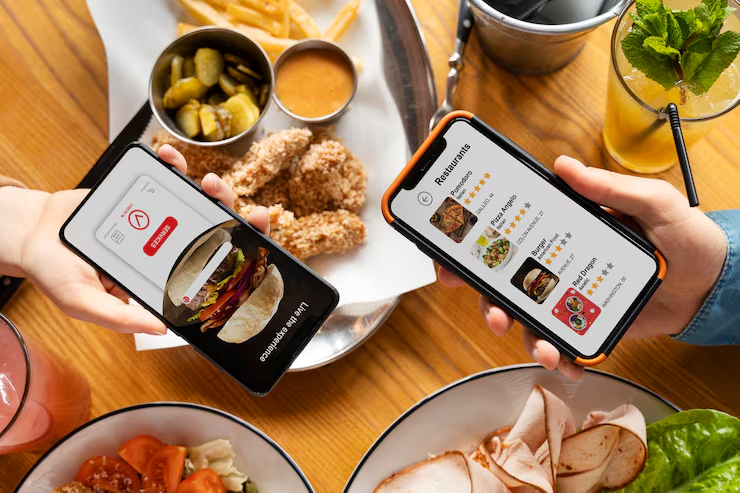
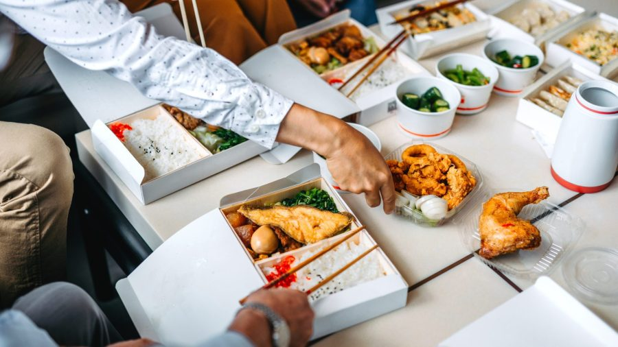
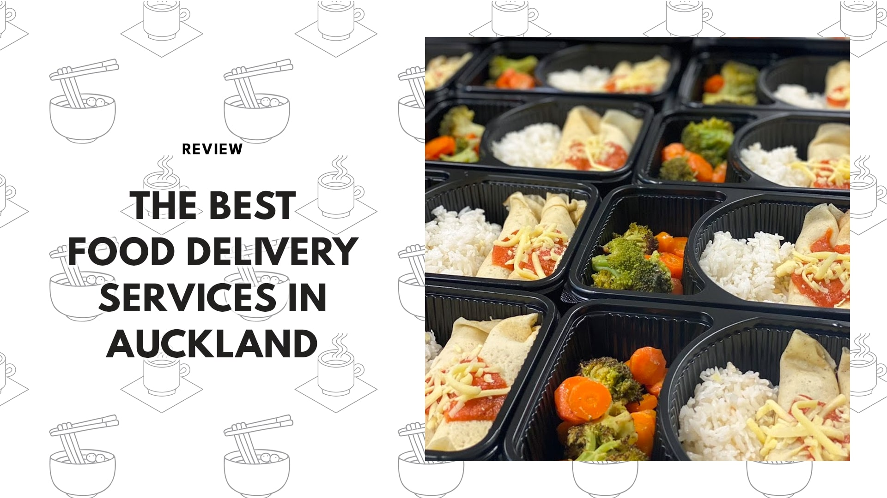

<p align="center">
  
  
</p>

<p align="center">
  
  
  
</p>

<p align="center">
  
  <br/>
</p>

---

## 🚀 Features

- **User Authentication:** Secure sign up, login, and logout.
- **Browse Restaurants:** Explore a variety of local restaurants.
- **Menu & Search:** View menus, search dishes, and filter by cuisine.
- **Cart & Checkout:** Add items to cart, edit orders, and checkout securely.
- **Order Tracking:** Real-time updates on your order status.
- **Payment Integration:** Pay online with multiple options.
- **Order History:** View past orders and reorder easily.
- **Responsive UI:** Optimized for mobile, tablet, and desktop.
- **Restaurant Dashboard:** Manage menus, orders, and analytics.
- **Admin Panel:** Oversee users, restaurants, and orders.
- **Notifications:** Get alerts for order status and offers.
- **Ratings & Reviews:** Rate dishes and share feedback.
- **Promotions:** Apply coupons and see special deals.
- **Multi-language Support:** Switch between languages.
- **Accessibility:** Keyboard navigation and screen reader support.

---

## 🛠️ Tech Stack

| 💻 Frontend              | 🖥️ Backend         | 🗄️ Database         | 🔑 Auth                | ☁️ Hosting                |
|-------------------------|--------------------|---------------------|------------------------|---------------------------|
| HTML5, CSS3, JavaScript | Node.js/Express    | MongoDB/MySQL       | JWT/Passport.js        | Vercel/Heroku/AWS         |

---

## 🖥️ Screenshots

> Replace with your own screenshots or assets.

<p align="center">
  
  
  
</p>

---

## 📂 Folder Structure

```bash
food-delivery/
│
├── images/      # Images and icons
├── index.html   # Main landing page
├── script.js    # JavaScript logic
├── style.css    # Stylesheet
└── Readme.md    # Project documentation
```

---

## ⚡ Getting Started

1. **Clone the repository:**
   ```sh
   git clone https://github.com/yourusername/food-delivery.git
   cd food-delivery
   ```
2. **Install dependencies:**
   ```sh
   npm install
   ```
3. **Configure environment variables:**  
   Set up your `.env` for backend credentials.
4. **Run the app:**
   ```sh
   npm start
   ```
5. **Open in browser:**  
   Visit `http://localhost:3000`

---

## 🌐 Live Demo

> Coming soon! Stay tuned for a hosted preview.

---

## 🤝 Contributing

Pull requests and suggestions are welcome!  
See [CONTRIBUTING.md](CONTRIBUTING.md) for guidelines.

---

## 📄 License

This project is licensed under the MIT License.

---

<p align="center">
  Inspired by <a href="https://www.swiggy.com/" target="_blank">Swiggy</a> & <a href="https://www.zomato.com/" target="_blank">Zomato</a> • Built for learning
